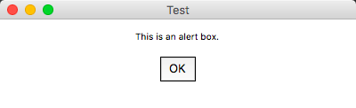
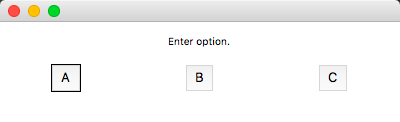
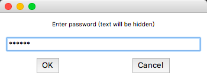
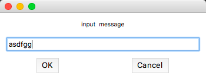

### pyautogui自动化控制鼠标和键盘操作

- [安装](#_3)
- [pyautogui鼠标操作样例](#pyautogui_7)
- [pyautogui键盘操作样例](#pyautogui_78)
- [按键支持](#_92)
- [提示信息](#_114)
- - alert
    - [option](#option_123)
    - [password](#password_130)
    - [prompt](#prompt_138)
- [截屏](#_146)
- - 整个屏幕截图并保存
    - [屏幕查找图片位置并获取中间点](#_155)
- [安全设置](#_165)

PyAutoGUI是一个纯Python的GUI自动化工具，其目的是可以用程序自动控制鼠标和键盘操作，多平台支持（Windows，OS X，Linux）。

## 安装

```
`pip3 install pyautogui` 

- 1
```

## pyautogui鼠标操作样例

```
`import pyautogui

# 获取当前屏幕分辨率
screenWidth, screenHeight = pyautogui.size()

# 获取当前鼠标位置
currentMouseX, currentMouseY = pyautogui.position()

# 2秒钟鼠标移动坐标为100,100位置  绝对移动
#pyautogui.moveTo(100, 100,2)
pyautogui.moveTo(x=100, y=100,duration=2, tween=pyautogui.linear)

#鼠标移到屏幕中央。
pyautogui.moveTo(screenWidth / 2, screenHeight / 2)

# 鼠标左击一次
#pyautogui.click()
# x 
# y 
# clicks 点击次数
# interval点击之间的间隔
# button 'left', 'middle', 'right' 对应鼠标 左 中 右或者取值(1, 2, or 3)
# tween 渐变函数
#
pyautogui.click(x=None, y=None, clicks=1, interval=0.0, button='left', duration=0.0, tween=pyautogui.linear)

# 鼠标相对移动 ,向下移动
#pyautogui.moveRel(None, 10)
pyautogui.moveRel(xOffset=None, yOffset=10,duration=0.0, tween=pyautogui.linear)

# 鼠标当前位置0间隔双击
#pyautogui.doubleClick()
pyautogui.doubleClick(x=None, y=None, interval=0.0, button='left', duration=0.0, tween=pyautogui.linear)

# 鼠标当前位置3击
#pyautogui.tripleClick()
pyautogui.tripleClick(x=None, y=None, interval=0.0, button='left', duration=0.0, tween=pyautogui.linear)

#右击
pyautogui.rightClick()

#中击
pyautogui.middleClick()

#  用缓动/渐变函数让鼠标2秒后移动到(500,500)位置
#  use tweening/easing function to move mouse over 2 seconds.
pyautogui.moveTo(x=500, y=500, duration=2, tween=pyautogui.easeInOutQuad)

#鼠标拖拽
pyautogui.dragTo(x=427, y=535, duration=3,button='left')

#鼠标相对拖拽
pyautogui.dragRel(xOffset=100,yOffset=100,duration=,button='left',mouseDownUp=False)

#鼠标移动到x=1796, y=778位置按下
pyautogui.mouseDown(x=1796, y=778, button='left')

#鼠标移动到x=2745, y=778位置松开（与mouseDown组合使用选中）
pyautogui.mouseUp(x=2745, y=778, button='left',duration=5)

#鼠标当前位置滚轮滚动
pyautogui.scroll()
#鼠标水平滚动（Linux）
pyautogui.hscroll()
#鼠标左右滚动（Linux）
pyautogui.vscroll()` 

- 1
- 2
- 3
- 4
- 5
- 6
- 7
- 8
- 9
- 10
- 11
- 12
- 13
- 14
- 15
- 16
- 17
- 18
- 19
- 20
- 21
- 22
- 23
- 24
- 25
- 26
- 27
- 28
- 29
- 30
- 31
- 32
- 33
- 34
- 35
- 36
- 37
- 38
- 39
- 40
- 41
- 42
- 43
- 44
- 45
- 46
- 47
- 48
- 49
- 50
- 51
- 52
- 53
- 54
- 55
- 56
- 57
- 58
- 59
- 60
- 61
- 62
- 63
- 64
- 65
- 66
- 67
```

## pyautogui键盘操作样例

```
`#模拟输入信息
pyautogui.typewrite(message='Hello world!',interval=0.5)
#点击ESC
pyautogui.press('esc')
# 按住shift键
pyautogui.keyDown('shift')
# 放开shift键
pyautogui.keyUp('shift')
# 模拟组合热键
pyautogui.hotkey('ctrl', 'c')` 

- 1
- 2
- 3
- 4
- 5
- 6
- 7
- 8
- 9
- 10
```

## 按键支持

| 按键                                  | 说明                                  |
| ------------------------------------- | ------------------------------------- |
| `enter`(或`return` 或 `\n`)           | 回车                                  |
| `esc`                                 | ESC键                                 |
| `shiftleft`, `shiftright`             | 左右SHIFT键                           |
| `altleft`, `altright`                 | 左右ALT键                             |
| `ctrlleft`, `ctrlright`               | 左右CTRL键                            |
| `tab` (`\t`)                          | TAB键                                 |
| `backspace`, `delete`                 | BACKSPACE 、DELETE键                  |
| `pageup`, `pagedown`                  | PAGE UP 和 PAGE DOWN键                |
| `home`, `end`                         | HOME 和 END键                         |
| `up`, `down`, `left`,`right`          | 箭头键                                |
| `f1`, `f2`, `f3`….                    | F1…….F12键                            |
| `volumemute`, `volumedown`,`volumeup` | 有些键盘没有                          |
| `pause`                               | PAUSE键                               |
| `capslock`, `numlock`,`scrolllock`    | CAPS LOCK, NUM LOCK, 和 SCROLLLOCK 键 |
| `insert`                              | INS或INSERT键                         |
| `printscreen`                         | PRTSC 或 PRINT SCREEN键               |
| `winleft`, `winright`                 | Win键                                 |
| `command`                             | Mac OS X command键                    |

## 提示信息

## alert

```
`#pyautogui.alert('This is an alert box.','Test')
pyautogui.alert(text='This is an alert box.', title='Test')` 

- 1
- 2
```



## option

```
`#pyautogui.confirm('Shall I proceed?')
pyautogui.confirm('Enter option.', buttons=['A', 'B', 'C'])` 

- 1
- 2
```



## password

```
`a = pyautogui.password('Enter password (text will be hidden)')
print(a)` 

- 1
- 2
```



## prompt

```
`a = pyautogui.prompt('input  message')
print(a)` 

- 1
- 2
```



## 截屏

## 整个屏幕截图并保存

```
`im1 = pyautogui.screenshot()
im1.save('my_screenshot.png')

im2 = pyautogui.screenshot('my_screenshot2.png')` 

- 1
- 2
- 3
- 4
```

## 屏幕查找图片位置并获取中间点

```
`#在当前屏幕中查找指定图片(图片需要由系统截图功能截取的图)
coords = pyautogui.locateOnScreen('folder.png')
#获取定位到的图中间点坐标
x,y=pyautogui.center(coords)
#右击该坐标点
pyautogui.rightClick(x,y)` 

- 1
- 2
- 3
- 4
- 5
- 6
```

## 安全设置

```
`import pyautogui

#保护措施，避免失控
pyautogui.FAILSAFE = True
#为所有的PyAutoGUI函数增加延迟。默认延迟时间是0.1秒。
pyautogui.PAUSE = 0.5` 

- 1
- 2
- 3
- 4
- 5
- 6
```